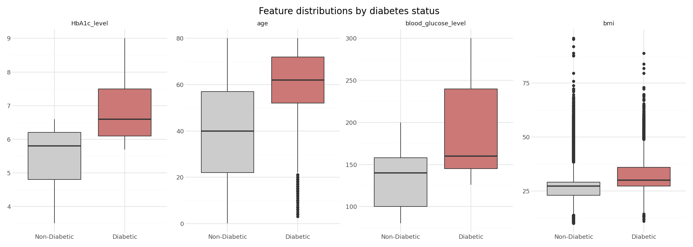
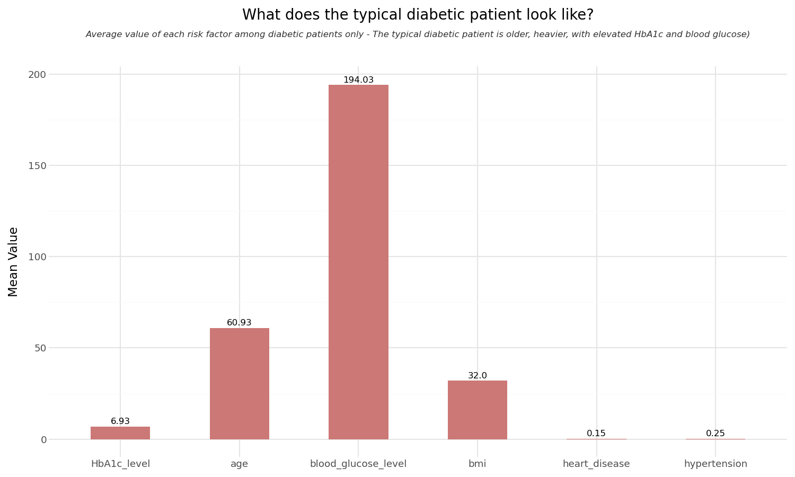
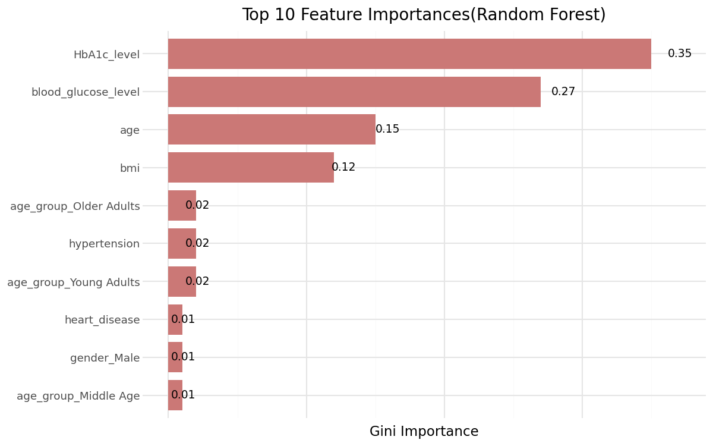

# Predicting Diabetes 
## *Risk Factor Analysis and Early Detection Model*  

**Author:** Johanna Ezedinma  
**Date:** June 2026   

---

  

---
## Executive Summary  

This project applies exploratory data analysis and binary classification to predict diabetes diagnosis from patient medical records. Using a dataset of 96,000 patients spanning eight clinical and demographic features, the analysis evaluates Logistic Regression and Random Forest models against a priority metric of recall: the ability to correctly identify diabetic patients.

The best model, a GridSearchCV-tuned Random Forest, achieved a recall of **0.92** on the unseen test set, correctly identifying 1,536 out of 1,696 diabetic patients. The project also surfaces the risk factor combinations most associated with a diabetes diagnosis, providing interpretable clinical insight alongside predictive performance.  

---

## Problem Statement

Standard classification models optimised for accuracy perform poorly on imbalanced medical datasets. With roughly 10 non-diabetic patients for every 1 diabetic patient, the baseline model achieved 96% accuracy while missing 37% of diabetic cases; a clinically unacceptable outcome.

The core challenge addresses two specific questions:

1. **Risk Identification:** Which combination of patient characteristics : age, BMI, HbA1c, blood glucose, hypertension, heart disease, smoking history and gender is most associated with a diabetes diagnosis?
3. **Early Detection:** Can a machine learning model correctly flag diabetic patients at a recall rate high enough to be useful in a clinical screening context?

---

## Key Findings

**From the EDA:**
HbA1c and blood glucose are the strongest individual predictors of diabetes. Age is the most important demographic factor; risk increases sharply after 45.   
The typical diabetic patient profile is: older age, elevated BMI, high HbA1c and blood glucose, often accompanied by hypertension or heart disease. No single feature tells the whole story. 

  

---
**From the ML Models:**
Class imbalance was the biggest obstacle. Addressing it explicitly with `class_weight='balanced'` and recall-focused hyperparameter tuning was the difference between a model that misses 37% of diabetic patients and one that misses only 8%.

 

 

 
---

## Model Comparison

| Model | Recall (Diabetic) | Precision (Diabetic) | Accuracy | ROC-AUC |
|---|---|---|---|---|
| Logistic Regression (default) | 0.63 | 0.86 | 0.96 | 0.96 |
| Logistic Regression (balanced) | 0.88 | 0.42 | 0.88 | 0.96 |
| Random Forest (default) | 0.69 | 0.94 | 0.97 | 0.96 |
| **Random Forest (tuned)** | **0.92** | 0.45 | 0.89 | 0.97 |

Recall was chosen as the priority metric because missing a diabetic patient carries a higher clinical cost than a false positive, which results only in further testing.

---

## Methodology

The project implements a structured analytical pipeline:

**Data Preparation:** Removed visualisation helper columns; encoded categorical variables (gender, smoking history, age group) using one-hot encoding; split data into train, validation and test sets (60/20/20) with stratification to preserve class balance.

**Feature Scaling:** Applied `StandardScaler` fitted on training data only, preventing data leakage into validation and test sets.

**Baseline Model:** Logistic Regression with odds ratio interpretation to establish feature importance and identify class imbalance as the primary challenge.

**Advanced Model:** Random Forest with 5-fold stratified cross validation and `GridSearchCV` hyperparameter tuning optimised for recall.

**Evaluation:** Models compared on validation set across recall, precision, F1 and ROC-AUC before a single final evaluation on the unseen test set.

---

## Dataset

[Diabetes Prediction Dataset](https://www.kaggle.com/code/fareedalianwar/diabetes-prediction/input)   
(0 = Non-Diabetic, 1 = Diabetic).

---

## Tools and Libraries

Python; pandas; numpy; plotnine; seaborn; matplotlib; scikit-learn; pyjanitor

---

## Repository Structure

`Diabetes_Visualization_and_Prediction.ipynb`  end-to-end notebook covering data cleaning, exploratory analysis, feature engineering and model training with markdown documentation throughout.

---

## Connect
   
 [GitHub](https://github.com/Johanna-ezedinma)
